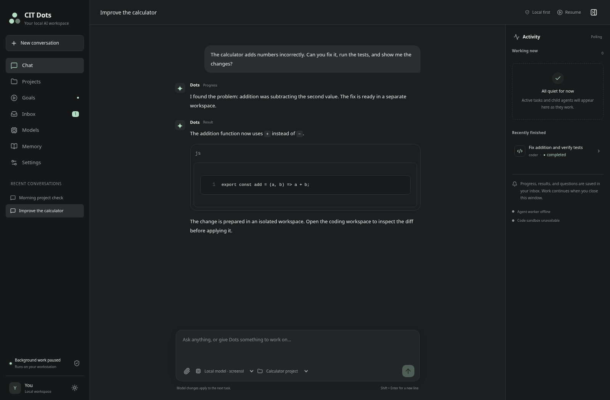

# CIT Dots

A local assistant framework with a chat interface, persistent tasks, specialist workers, coding workspaces and local model profiles. It uses Node 24, Next.js, Eve and SQLite. Ollama or LM Studio supplies the model; the application does not need a cloud model API key.

The broker and agent worker run independently of the browser. They can continue accepted work and deliver results to a durable inbox after the GUI closes. User-defined goals can trigger scheduled work. Idle services wait rather than continuously spending GPU time or posting check-ins.

## Start on Ubuntu 26.04

Install Node 24, Docker and a local model server, then follow [the workstation setup](docs/setup.md). From this repository:

```bash
cp .env.example .env
npm ci
docker build -t cit-dots-sandbox:latest sandbox
npm run dev
```

Open [http://127.0.0.1:3000](http://127.0.0.1:3000). Add a local model profile, discover the model IDs and run its connection/tool-use check. Register a project for coding work. The default database is empty; setup does not add demo conversations or download model weights.

For daily background use, build and install the user services:

```bash
npm run build
node scripts/install-services.mjs
systemctl --user daemon-reload
systemctl --user enable --now cit-dots.target
```

See [the operations runbook](docs/runbook.md) for desktop notifications, startup after logout, backup and restore. Linger is an explicit workstation setting; installing the services does not enable it automatically.

## What the framework provides

- Text chat and task progress, results, questions and errors in a persistent session.
- Coordinator, coding, investigation and review workers with bounded delegation.
- Registered project workspaces, Docker command execution and reviewable diffs.
- Model profiles and snapshots for tasks, with concurrency and execution budgets.
- User-defined one-time, interval and cron goals, plus explicit local memories.
- A durable notification inbox and an optional Ubuntu desktop bridge.

External effects and network-enabled command execution require the application's approval flow. Review a task's diff before applying its workspace changes to the original project. The first release is text based; it does not include voice listening or bundled messaging connectors.

## Interface preview

These screenshots use an isolated test project with real file edits and recorded UI state. The model is a deterministic test fixture.




## Development checks

```bash
npm run typecheck
npm run build
npm run test:all
npm run test:gui
```

`test:all` includes actual Docker execution and the production Eve runtime. Build the sandbox and application first. For browser tests, set `CIT_CHROMIUM_PATH` to your Chromium executable or use `npx playwright install chromium` and leave it unset. See [verification](docs/verification.md) for the test boundaries.

The full suite passed **44 of 44 tests with no skips**, including production Eve, a deterministic local provider and real Docker execution. Type checking, the production build and GUI tests also passed.

## Read more

- [Architecture and delivery plan](docs/architecture.md)
- [Ubuntu setup](docs/setup.md)
- [Ollama and LM Studio](docs/local-models.md)
- [Hardware sizing and two-GPU options](docs/hardware.md)
- [Operations, diagnostics and recovery](docs/runbook.md)
- [Verification and its limits](docs/verification.md)

Real Ollama/LM Studio model reasoning and GPU inference were **not tested here**. Deterministic model fixtures verify integration behavior; they do not establish the quality, speed or reliability of a chosen model. Use the hardware acceptance checklist on the target PC.
