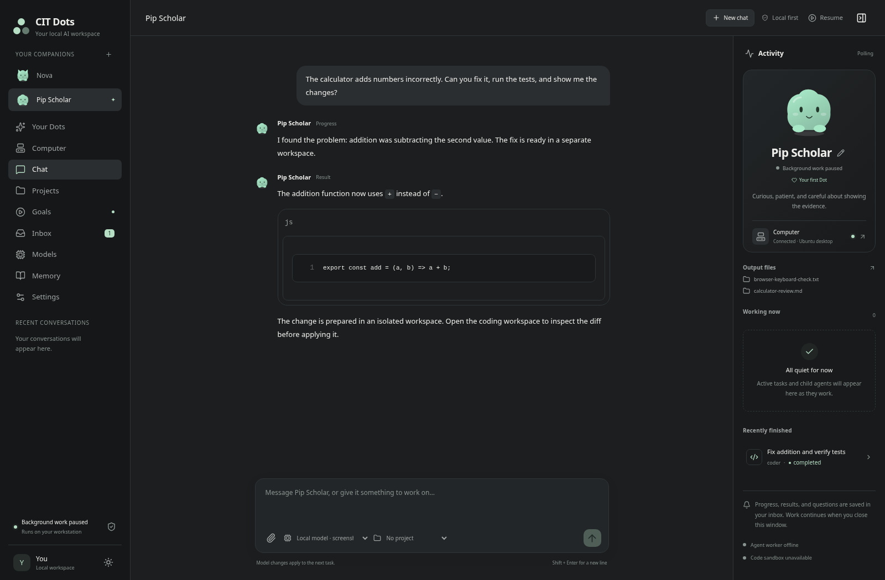
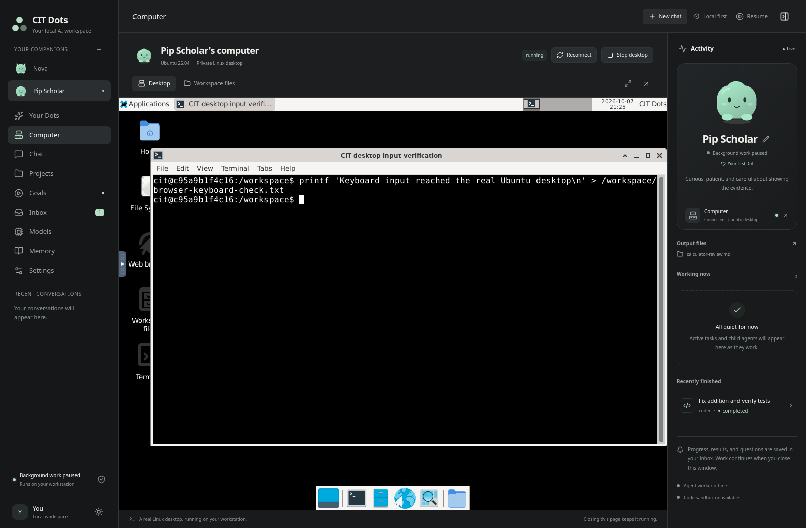
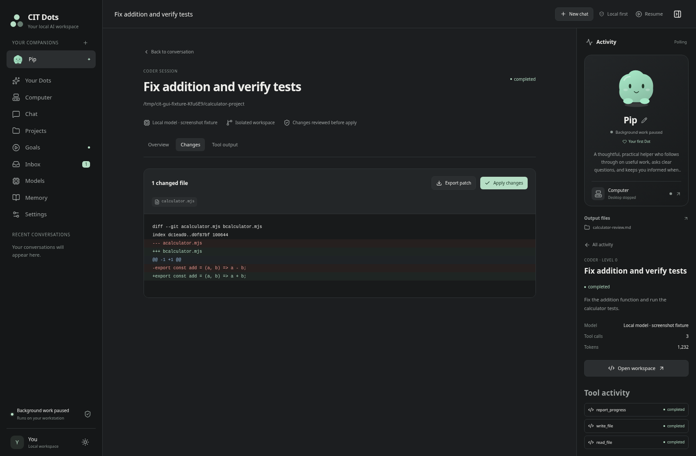

# CIT Dots

A local assistant framework with personal Dots, a chat interface, persistent tasks, specialist workers and a real graphical Linux computer for each Dot. It uses Node 24, Next.js, Eve, SQLite and Docker. Ollama or LM Studio supplies the model; the application does not need a cloud model API key.

The broker and agent worker run independently of the browser. They can continue accepted work and deliver results to a durable inbox after the GUI closes. User-defined goals can trigger scheduled work. Idle services wait rather than continuously spending GPU time or posting check-ins.

## Start on Ubuntu 26.04

Install Node 24, Docker and a local model server, then follow [the workstation setup](docs/setup.md). From this repository:

```bash
cp .env.example .env
npm ci
docker build -t cit-dots-sandbox:latest sandbox
docker build -t cit-dots-desktop:latest -f desktop/Dockerfile .
npm run dev
```

Open [http://127.0.0.1:3000](http://127.0.0.1:3000). Pip, the permanent primary Dot, is created automatically. Customize its name and pet, add a local model profile and run its connection/tool-use check. Add extra Dots when needed, and open Computer to start the selected Dot's Ubuntu/Xfce desktop. Setup adds no demo conversations and downloads no model weights. Register a project when you want reviewable changes to an existing repository.

Use the upper-right New chat button to open an empty conversation, then choose Chat or Work for an independent session without a Dot. Selecting a Dot opens its saved main conversation, with its identity, computer, activity and output files beside it. Meaningful updates and questions from its child workers and scheduled work appear in that main conversation. Independent sessions keep their own identity and survive removal of an extra Dot.

For daily background use, build and install the user services:

```bash
npm run build
node scripts/install-services.mjs
systemctl --user daemon-reload
systemctl --user enable --now cit-dots.target
```

See [the operations runbook](docs/runbook.md) for desktop notifications, startup after logout, backup and restore. Linger is an explicit workstation setting; installing the services does not enable it automatically.

## What the framework provides

- A permanent primary Dot plus removable additional Dots, each with its own name, personality, pet and saved work.
- An interactive Ubuntu 26.04/Xfce computer per Dot, with a browser, terminal and file manager; its home, workspace and artifacts persist when stopped.
- Text chat and task progress, results, questions and errors in a persistent session.
- Independent chat and coding/work sessions without a Dot.
- Coordinator, coding, investigation and review workers with bounded delegation.
- Registered project workspaces, Docker command execution and reviewable diffs.
- Model profiles and snapshots for tasks, with concurrency and execution budgets.
- User-defined one-time, interval and cron goals, plus explicit local memories.
- A durable notification inbox and an optional Ubuntu desktop bridge.

The graphical computers use Docker containers sharing the host kernel, not virtual machines. Each has a private internal network with no outbound internet and a loopback display relay for the local GUI. The existing exact-command network approval applies to agent command execution separately. Agents use file and command tools, including commands that launch graphical apps; automated screenshot, mouse and keyboard tools are not included. All computation is local and requires the workstation to be awake. Review a task's diff before applying project changes. This release uses text interaction and does not include voice listening or bundled messaging connectors.

## Interface preview

These screenshots use isolated test state and a deterministic model fixture. The computer screenshot shows an authenticated, running Ubuntu/Xfce desktop; GUI keyboard input created a file that the Dot file API read back. The coding preview contains real edits in the isolated test project.







## Development checks

```bash
npm run typecheck
npm run build
npm run test:all
CIT_TEST_DESKTOP=1 npm run test:gui
```

`test:all` includes actual Docker desktops and command execution plus the production Eve runtime. Build both Docker images and the application first. Tests run serially to limit peak disk usage. For browser tests, set `CIT_CHROMIUM_PATH` to your Chromium executable or use `npx playwright install chromium` and leave it unset. See [verification](docs/verification.md) for the test boundaries.

On **October 7, 2026**, the full suite passed **81 of 81 tests with no skips**, using production Eve, actual Docker desktops/commands and a deterministic local provider. The desktop-enabled GUI suite passed **3 of 3 tests**, including real noVNC authentication and keyboard input. Type checking, the production build and formatting checks also passed. See the verification guide for the measured scope and remaining workstation checks.

## Read more

- [Architecture and delivery plan](docs/architecture.md)
- [Official Dots/Muse research and CIT Dots policy](docs/dots-research.md)
- [Ubuntu setup](docs/setup.md)
- [Ollama and LM Studio](docs/local-models.md)
- [Hardware sizing and two-GPU options](docs/hardware.md)
- [Operations, diagnostics and recovery](docs/runbook.md)
- [Verification and its limits](docs/verification.md)

Real Ollama/LM Studio model reasoning and GPU inference were **not tested here**. Deterministic model fixtures verify integration behavior; they do not establish the quality, speed or reliability of a chosen model. Use the hardware acceptance checklist on the target PC.
