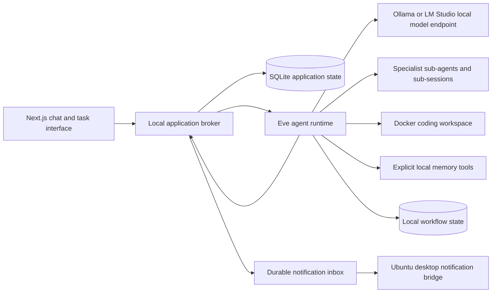

# Architecture and implementation plan

CIT-Dots is a self-hosted assistant for one Ubuntu workstation. Its local web interface talks to a persistent agent service rather than keeping work alive in a browser tab. Local language models live in a separate inference service, so the workstation can change models without replacing the assistant framework.

## Services and durable state

The broker owns application records, task dispatch, dynamic child lineage, shared quotas, model profiles and notifications. Eve executes the persistent worker sessions and resumable tool workflows. SQLite stores application state; Eve's local workflow storage must also persist. Coding workspaces and their independent Git history live outside disposable sandbox containers. Specialist children work within their root task's workspace; read-only roles cannot acquire writable tools by delegation.

Do not run the broker, Eve or the GUI server from a short-lived shell for daily use. The supplied user systemd services are the workstation's process manager. Closing the GUI leaves those services running. Running after logout or reboot requires the explicit systemd linger setup described in the runbook.

## How autonomy works

An always-running process does not need to spend GPU time continuously. Accepted tasks and meaningful events trigger agent runs. A task can delegate research, implementation or review to specialist sub-agents, retain its session and produce a result later. Child agents share the same model server through bounded request concurrency; each child does not need its own model copy.

Idle services wait for work. User-defined one-time, interval or cron goals can trigger the same task workflow when due. This implementation does not add recurring check-in prompts, voice listening or a background loop that repeatedly asks a model to invent work. Future connectors should enqueue distinct events and deduplicate delivery before starting a run. A notification is appropriate when work completes, fails, needs user input or produces a material change.

## Models and memory

A model profile identifies a provider endpoint and model ID. The application checks server reachability and should test a real tool call before using a model for unattended coding. An OpenAI-compatible endpoint does not guarantee correct tool calling, streaming or context limits for every model.

Keep one selected model profile on each task or session. A change to the default model should affect future work; an in-progress turn should not silently switch model or template. Model loading and unloading belong to the inference service. Loading a large model may take time and consume memory needed by existing runs.

Memories are explicit SQLite records. The broker supplies bounded saved context and recent conversation history to each worker step. Editing or deleting a memory changes subsequent context construction; it does not delete the original conversation. This release uses local text retrieval without an embedding service. Model context limits remain separate from persisted history.

## Coding execution

Coding tasks use a dedicated workspace and Docker sandbox. Source files, diffs and test results make changes reviewable. A sandbox cannot complete a real code task without the repository, supported build tools and any necessary dependencies. Network or system access should be an explicit configuration rather than an accidental consequence of the model endpoint.

Git workspaces are self-contained clones with independent refs and no remote. A coding root and its child sessions share that isolated workspace, with file changes and commands serialized. The original project is updated only through the reviewed apply operation, which checks for conflicts before writing files.

Global pause holds new model requests and tool admissions. A command already running can finish; use Cancel to terminate it. Paused time is excluded from task deadlines. Token quotas reserve conservative input/output estimates and add any excess usage reported by the provider.

Implementation locations: `src/server/broker.ts` handles goals and tasks; `api.ts` handles validated local routes; `models.ts` adapts inference; `store.ts` persists state; `workspaces.ts` and `runner.ts` handle code; `agent/` contains Eve configuration/tools; `components/dots/` contains the GUI.

The assistant should distinguish producing a patch from running a program, and a local test from a deployment. A normal chat response, a file edit, a tool call and an external action should each have visible progress and an actionable failure message.

## Delivery stages

| Stage                  | Deliverable                                                               | Acceptance evidence                                                 |
| ---------------------- | ------------------------------------------------------------------------- | ------------------------------------------------------------------- |
| Local foundation       | Chat GUI, local model profiles, persistent application and workflow state | A real local model reply appears; services survive GUI closure      |
| Delegated work         | Task dispatch, sub-agents and isolated coding tools                       | A task delegates and returns an actual code change with test output |
| Workstation operations | User services, durable notices, diagnostics, backup and restore           | Restart and restore checks preserve recorded state                  |
| Hardware tuning        | Tested model, context and inference concurrency profiles                  | Measured memory and latency on the actual GPUs                      |
| Optional integrations  | Event sources and scoped external tools                                   | An actual authorized event/action works with duplicate handling     |

Features in the later stages must be treated as unverified until their acceptance checks pass. This repository provides a local framework; it does not claim to reproduce the training, private implementation or capabilities of another company's assistant.

## Persistence and recovery boundary

Preserve both application data and `.eve/.workflow-data`, plus the coding workspace files. A process restart can recover stored application records; recovery of an unfinished workflow also depends on the installed Eve release and compatible authored workflow code. A saved task is not evidence that every interrupted shell command can safely replay.

Backups are private because they can contain chat text, source code and task artifacts. Runtime credentials remain in local environment files and are excluded from the normal backup. Reconfigure those credentials separately after restore.

## Framework references

- [Eve self-hosting](https://eve.dev/docs/guides/deployment/self-hosting): Node service, local workflow persistence and callback routes.
- [Eve sub-agents](https://eve.dev/docs/subagents): specialist execution and session delegation.
- [Ollama GPU and concurrency documentation](https://github.com/ollama/ollama/blob/main/docs/faq.mdx): model residency and inference memory.

Eve is a preview framework. Keep the lockfile and pin tested upgrades; verify recovery and tool execution before updating a workstation with active work.
