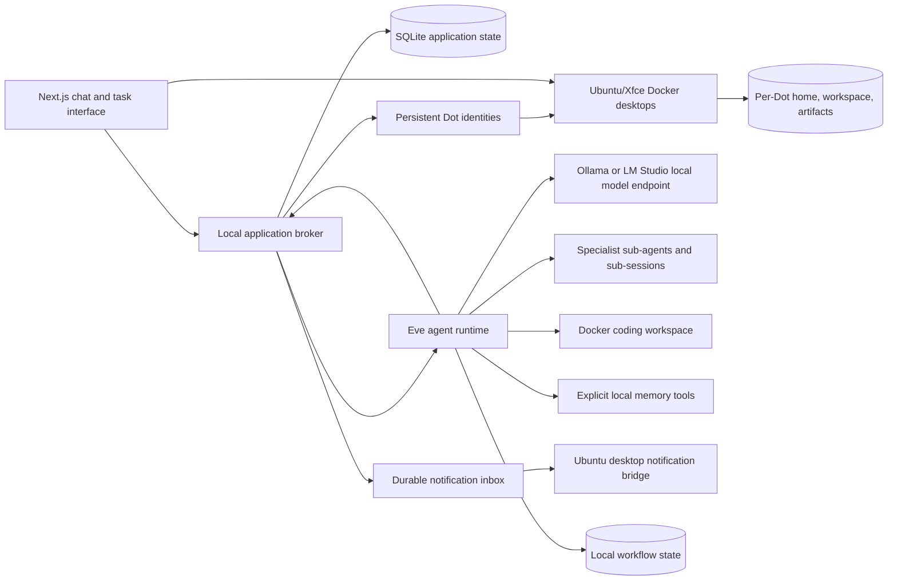

# Architecture and implementation plan

CIT-Dots is a self-hosted assistant for one Ubuntu workstation. A Dot is the persistent coordinator: it talks with the user, assigns work to specialist agents and explains their progress and results in plain language. Coding agents produce code in their own work sessions and workspaces. The local web interface talks to a persistent agent service rather than keeping work alive in a browser tab. Local language models live in a separate inference service, so the workstation can change models without replacing the assistant framework.

## Services and durable state

The broker owns application records, task dispatch, dynamic child lineage, shared quotas, model profiles and notifications. Eve executes the persistent worker sessions and resumable tool workflows. SQLite stores application state; Eve's local workflow storage must also persist. Coding workspaces and their independent Git history live outside disposable sandbox containers. Specialist children work within their root task's workspace; read-only roles cannot acquire writable tools by delegation.

Do not run the broker, Eve or the GUI server from a short-lived shell for daily use. The supplied user systemd services are the workstation's process manager. Closing the GUI leaves those services running. Running after logout or reboot requires the explicit systemd linger setup described in the runbook.

## Persistent Dots and graphical computers

Each Dot has a durable ID, name, personality, pet appearance and default model profile. Pip is created as the primary Dot and cannot be removed or lose primary status. Extra Dots can be created and removed. These are CIT Dots product choices; [the research note](dots-research.md) distinguishes them from documented ChatGPT behavior.

Dot sessions, tasks, goals, memories and inbox items belong to their Dot. Worker children inherit the parent task's owner; delegation does not grant access to another Dot's records or files. Models and registered projects remain shared. A Dot identity persists independently of its current tasks, sub-sessions or desktop process.

Standalone chat and work sessions have explicit null Dot ownership. The upper-right New chat action opens an empty conversation with Chat and Work modes. Legacy records without an ownership field migrate to the primary Dot; explicit null remains independent through migration and restart. Independent chat receives general context and its conversation history without private Dot memory or computer access. Independent work uses its approved project workspace. Deleting an extra Dot retains independent sessions.

Each Dot has one stable main conversation. Temporary child/worker sessions retain their own execution history and code output. The Dot delegates implementation and investigation instead of using the worker file and command tools itself. Its main conversation contains plain-language progress, summaries and questions, including work started by a schedule. Worker code and raw tool output stay in the work session and activity views; they are not copied into the Dot's replies. The user can follow that Dot's ongoing work in one conversation.

When the user asks for a worker's output file, the Dot can forward a downloadable attachment from that worker's workspace. A delivered file is a durable snapshot with a source task reference; download cards do not render its contents as code in the Dot conversation. The broker checks task lineage, Dot ownership, the workspace path and the file size before creating the handoff. The identity panel's Output files list contains files actually shared in the Dot conversation. Other workspace files remain available through the computer's Files view. Standalone Chat and Work sessions retain Markdown and code rendering.

Each Dot owns `.cit-data/dots/<dotId>/computer/{home,workspace,artifacts}`. Its Ubuntu 26.04/Xfce desktop is real, streamed with TigerVNC/noVNC for interactive browser, terminal and file-manager use. File and command tools use the trusted Dot's computer storage. Project tasks retain isolated project clones and explicit diff/apply semantics. Agent command operations for one Dot are serialized; separate Dots receive separate mounts.

Commands can run inside a live Dot desktop and inherit its display session to launch graphical applications. A delegated worker with a tested vision profile also receives the `computer` tool. Coder workers can capture screenshots, move, click, drag, scroll, type text and send key combinations. Investigator and reviewer workers receive a screenshot-only tool schema, backed by broker enforcement. The parent coordinator and independent sessions do not receive graphical tools. The Dot delegates computer work and keeps screenshots, code and technical evidence in worker sessions.

Graphical actions operate on the same X11 display streamed by noVNC. The worker first observes a real screenshot, chooses screen pixel coordinates, performs a bounded action, then captures the result. The broker queries the actual X pointer, and the viewer maps those coordinates to its scaled canvas for a visible Agent cursor. The cursor follows executed desktop input.

The viewer starts in watch mode with noVNC input disabled. Take control changes trusted host-side ownership, cancels and drains that Dot's current graphical actions and commands, then enables human input. All open viewers wait for the handover to finish. If guest cleanup cannot be confirmed, persisted pending ownership blocks both worker and viewer input; Take control can retry the exact cleanup. New graphical input and Dot-owned command admissions are blocked while human control remains active, including project commands that could otherwise reach the display. Screenshot inspection remains available. Give control back restores worker admission; it does not replay a canceled action automatically. Control ownership survives broker restarts. Stale or failed viewer control updates revert the viewer to watch mode.

The default desktop is 1440 × 900. PNG capture is limited to 2 MiB, 4096 pixels per side and 12 million pixels total. Input requests bound text to 4000 characters, key chords to five supported keys, scroll steps to twenty and pointer/drag motion to 1500 milliseconds. A guest action has a twelve-second time limit and a fifteen-second host timeout. These are enforced bounds, not measured model throughput. Actions use validated owned containers, literal arguments and cancellable guest jobs; cancellation confirms process cleanup and releases injected buttons, modifiers and ordinary keycodes. Existing root task, tool-call, step, duration and token budgets still apply.

The desktop image supplies the OS and applications. Owned computer files persist, while temporary runtime directories can be recreated. A desktop can be stopped without deleting its Dot, and closing the GUI does not stop its work. Removing an extra Dot stops its work and desktop before deleting only its owned state, leaving original source projects intact.

The isolation boundary is a Docker container sharing the host kernel, not a VM. Each desktop has its own private internal network with no outbound internet, a non-root guest user, resource limits and no host Docker socket or GPU devices. A broker-managed display relay listens only on loopback and connects to the validated owned container's internal noVNC address; this avoids widening guest networking to publish the display. Host lifecycle metadata and connection credentials sit outside the shared computer storage; the desktop receives a dedicated read-only authentication-secret mount. The broker returns the connection URL to the local GUI and does not automatically place the URL/password in model context or logs. Guest code can read its own VNC authentication files. Network approval for an exact agent command does not enable internet access in the graphical browser.

## How autonomy works

An always-running process does not need to spend GPU time continuously. Accepted tasks and meaningful events trigger agent runs. A task can delegate research, implementation or review to specialist sub-agents, retain its session and produce a result later. Child agents share the same model server through bounded request concurrency; each child does not need its own model copy.

The Dot can start a worker asynchronously with `delegate` and `wait:false`, inspect its state with `task_status`, and continue talking with the user while work runs. `send_worker_message` sends either a steering instruction or a queued follow-up to that worker's existing session. A completed worker can continue in the same task and workspace, preserving its conversation history. Delivery receipts and confirmed turn boundaries keep queued follow-ups from being mistaken for completed work.

A confirmed asynchronous worker completion or failure wakes a coordinator review turn in the Dot's permanent conversation. The review checks the worker's evidence and can continue that worker or send a prose result, progress update or necessary question. Completion events are deduplicated and do not authorize file sharing. A review may retain the originating user's explicit request for that exact worker, so a request to create and send a file can finish without another prompt. Later user instructions replace that request context. Other past requests are not available as delivery permission.

Direct messages to a Dot-owned Work session queue into its existing worker session through the coordinator; independent Work remains independent. Retrying a stopped Dot worker creates a coordinator that can delegate a new managed worker while preserving the existing workspace. Accepted queue and steer deliveries are tracked by their actual Eve delivery IDs, including when completion arrives before the send response. Each queued turn retains a separate worker message, and only the latest settled turn becomes its current result. Uncertain sends after a restart are interrupted for inspection rather than silently repeated.

Idle services wait for work. User-defined one-time, interval or cron goals can trigger the same task workflow when due. This implementation does not add recurring check-in prompts, voice listening or a background loop that repeatedly asks a model to invent work. Future connectors should enqueue distinct events and deduplicate delivery before starting a run. A notification is appropriate when work completes, fails, needs user input or produces a material change.

## Models and memory

A model profile identifies a provider endpoint and model ID. The application checks server reachability and should test a real tool call before using a model for unattended coding. An OpenAI-compatible endpoint does not guarantee correct tool calling, streaming or context limits for every model.

Computer vision is opt-in per model profile with `visionEnabled`, labeled Use screenshots for computer tasks in the GUI. Check connection verifies streaming and a harmless tool call; when enabled, it also asks the same local endpoint to identify a 64 × 64 red PNG. Graphical workers require the tested vision capability and a passing tool-call check. Editing a profile clears its capabilities until rechecked. These separate probes establish endpoint compatibility, not visual reasoning or autonomous task quality on real apps.

Screenshot output enters Eve as an image part, not base64 prose. Before inference, the local proxy validates inline PNG format, dimensions and the 2 MiB size limit, keeps only the latest image in the request, and replaces earlier images with a short omission marker. It reserves 4096 tokens per image plus a conservative text estimate, reconciling any excess provider-reported usage. That estimate is an application budget, not the model's actual image-token formula. Screen bytes are redacted from public events and operation-detail responses; private worker/tool and workflow state can retain screenshots and belongs in protected backups.

Keep one selected model profile on each task or session. A change to the default model should affect future work; an in-progress turn should not silently switch model or template. Model loading and unloading belong to the inference service. Loading a large model may take time and consume memory needed by existing runs.

Memories are explicit SQLite records. Dot context includes only that Dot's bounded saved memories and the relevant conversation history; standalone sessions use their independent general context. Editing or deleting a memory changes subsequent context construction; it does not delete the original conversation. This release uses local text retrieval without an embedding service. Model context limits remain separate from persisted history.

## Coding execution

Coding tasks use a dedicated workspace and Docker sandbox. Source files, diffs and test results make changes reviewable. A sandbox cannot complete a real code task without the repository, supported build tools and any necessary dependencies. Network or system access should be an explicit configuration rather than an accidental consequence of the model endpoint.

Git workspaces are self-contained clones with independent refs and no remote. A coding root and its child sessions share that isolated workspace, with file changes and commands serialized. The original project is updated only through the reviewed apply operation, which checks for conflicts before writing files.

Global pause holds new model requests and tool admissions. A command already running can finish; use Cancel to terminate it. Paused time is excluded from task deadlines. Token quotas reserve conservative input/output estimates and add any excess usage reported by the provider.

Implementation locations: `src/server/broker.ts` handles goals and tasks; `api.ts` handles validated local routes; `models.ts` adapts inference; `store.ts` persists state; `workspaces.ts` and `runner.ts` handle code; `agent/` contains Eve configuration/tools; `components/dots/` contains the GUI.

The assistant should distinguish producing a patch from running a program, and a local test from a deployment. A normal chat response, a file edit, a tool call and an external action should each have visible progress and an actionable failure message.

## Delivery stages

| Stage                  | Deliverable                                                               | Acceptance evidence                                                 |
| ---------------------- | ------------------------------------------------------------------------- | ------------------------------------------------------------------- |
| Local foundation       | Chat GUI, local model profiles, persistent application and workflow state | A real local model reply appears; services survive GUI closure      |
| Delegated work         | Task dispatch, sub-agents and isolated coding tools                       | A task delegates and returns an actual code change with test output |
| Workstation operations | User services, durable notices, diagnostics, backup and restore           | Restart and restore checks preserve recorded state                  |
| Hardware tuning        | Tested model, context and inference concurrency profiles                  | Measured memory and latency on the actual GPUs                      |
| Optional integrations  | Event sources and scoped external tools                                   | An actual authorized event/action works with duplicate handling     |

Features in the later stages must be treated as unverified until their acceptance checks pass. This repository provides a local framework; it does not claim to reproduce the training, private implementation or capabilities of another company's assistant.

## Persistence and recovery boundary

Preserve both application data and `.eve/.workflow-data`, including Dot and standalone-session records, computer directories, `computer-state` task metadata and coding workspace files. Stop graphical desktops as well as application writers before taking an offline snapshot. Desktop authentication and lifecycle metadata are excluded; new credentials are generated when restored computers start. A process restart can recover stored application records; recovery of an unfinished workflow also depends on the installed Eve release and compatible authored workflow code. A saved task is not evidence that every interrupted shell command can safely replay.

Backups are private because they can contain chat text, source code and task artifacts. Runtime credentials remain in local environment files and are excluded from the normal backup. Reconfigure those credentials separately after restore.

## Framework references

- [Eve self-hosting](https://eve.dev/docs/guides/deployment/self-hosting): Node service, local workflow persistence and callback routes.
- [Eve sub-agents](https://eve.dev/docs/subagents): specialist execution and session delegation.
- [Ollama GPU and concurrency documentation](https://github.com/ollama/ollama/blob/main/docs/faq.mdx): model residency and inference memory.

Eve is a preview framework. Keep the lockfile and pin tested upgrades; verify recovery and tool execution before updating a workstation with active work.
